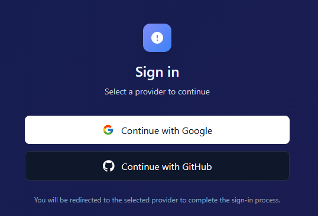
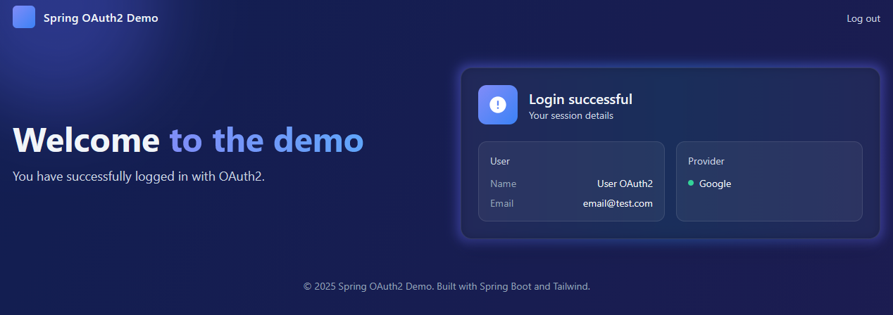

# OAuth2 Login Demo

Simple Spring Boot app showing Google & GitHub OAuth2 login. Custom login page, secured home, and user info display.

## Features
- OAuth2 login (Google & GitHub)
- Custom login page and secured home
- Displays basic user info (name, email when available)

## Prerequisites
- Google/GitHub OAuth app credentials

## Screenshots

## Tech Stack
- Java 21
- Spring Boot 3
- Spring Security (OAuth2 Client)
- Spring Web
- Thymeleaf 
- Tailwind CSS 
